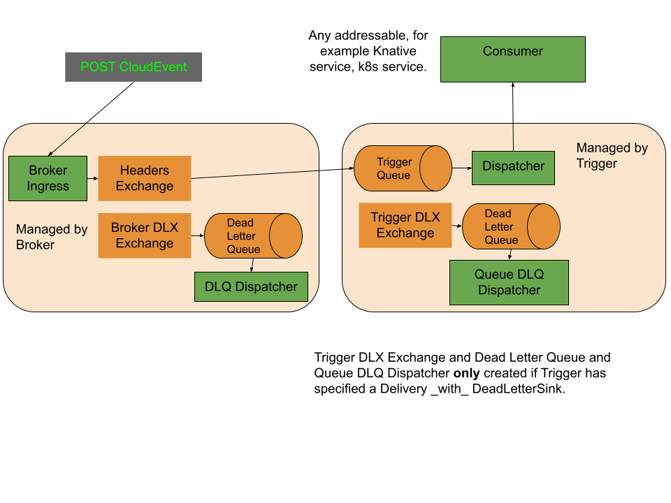

# Eventing RabbitMQ Broker

RabbitMQ *is a Messaging Broker* - an intermediary for messaging. It gives your applications a common platform to send and receive messages, and your messages a safe place to live until received.



# Table of Contents

- [Installation](#installation)
- [Customizations](#customizations)
- [Delivery Failures and Delivery Spec](#delivery-failures-and-delivery-spec)
- [Troubleshooting](#troubleshooting)
- [Next Steps](#next-steps)
- [Additional Resources](#additional-resources)
- [Upgrade](#upgrade)
- [Uninstall](#uninstall)

## Installation

### Install Eventing RabbitMQ Broker

Install the latest version of the [Operator based Knative RabbitMQ Broker](https://github.com/knative-extensions/eventing-rabbitmq/releases/):

```shell
kubectl apply --filename https://github.com/knative-extensions/eventing-rabbitmq/releases/latest/download/rabbitmq-broker.yaml
```

Or install a specific version, e.g., v0.25.0, run:

```shell
kubectl apply --filename https://github.com/knative-extensions/eventing-rabbitmq/releases/download/v0.25.0/rabbitmq-broker.yaml
```

Or install a nightly version:

```shell
kubectl apply -f https://storage.googleapis.com/knative-nightly/eventing-rabbitmq/latest/rabbitmq-broker.yaml
```

For development purposes or to use the latest from the repository, use [`ko`](https://github.com/google/ko) for installation from a local copy of the repository.

```
ko apply -f config/broker/
```

Follow the [Broker-Trigger quick setup](../../samples/broker-trigger/quick-setup/) example to deploy a basic topology.

## Customizations

### Autoscaling (optional)

To get autoscaling (scale to zero as well as up from 0), you can also optionally
install
[KEDA based autoscaler](https://github.com/knative-extensions/eventing-autoscaler-keda).

### Trigger Parallelism Count
Trigger has a configurable annotation `rabbitmq.eventing.knative.dev/parallelism`. If set to `n`, the trigger will create `n` workers to consume messages off the queue and dispatch to the sink.
If this value is unset, it will default to `1`. This means that the trigger will only have a single worker consuming messages. This will preserve the order of the messages in a queue but
can make the trigger a bottleneck. A slow processing sink will result in low overall throughput. Setting a value higher than 1 will result in `n` events being handled at
a time by the trigger but ordering won't be guaranteed as events are sent to the sink.

More details and samples of this can be found [here](../../samples/broker-trigger/trigger-customizations)

## Delivery Failures and Delivery Spec
A subset of HTTP status codes from a sink are considered a [retryable error](https://github.com/knative/specs/blob/main/specs/eventing/data-plane.md#event-acknowledgement-and-delivery-retry). When this occurs, delivery spec (available on Trigger and Broker) can specify how messages are retried and "dead-lettered". Reference
[Configuring Broker event delivery](https://knative.dev/docs/eventing/event-delivery/#configuring-broker-event-delivery)
for more information.

If no delivery spec is defined on a trigger, it will fallback to the broker delivery spec. If a delivery spec isn't defined on the
broker either, the message will be NACK-ed and dropped after the first failure.

## Troubleshooting
If the messaging topology isn't working as expected, the conditions on brokers and triggers can highlight errors encountered as well as give a reason for the failure. Below is a list of conditions and how they're used:

| Component | Condition              | Usage                                                                                                                                                                                                                                     |
|-----------|------------------------|-------------------------------------------------------------------------------------------------------------------------------------------------------------------------------------------------------------------------------------------|
| Broker    | ExchangeReady          | Used to show progress with creating exchanges for the broker as well as any dead letter exchanges.                                                                                                                                        |
| Broker    | DLXReady               | For any errors related to creating or updating the dead letter queue for the broker. Will say `DeadLetterSinkNotConfigured` when delivery spec isn't defined.                                                                             |
| Broker    | DeadLetterSinkReady    | For any errors with creating a binding between the dead letter exchange and queue. Also used for any error with creating a dispatcher for the dead letter queue. Will say `DeadLetterSinkNotConfigured` when delivery spec isn't defined. |
| Trigger   | BrokerReady            | For any broker related issues such as: broker not ready, broker not found etc.                                                                                                                                                            |
| Trigger   | DependencyReady        | For any failures when reconciling a triggers dependency such as Queue, Exchange, Binding or the dispatcher Deployment                                                                                                                     |
| Trigger   | DeadLetterSinkResolved | Highlight any errors resolving the dead letter sink's URI. May also be `DeadLetterSinkNotConfigured` when delivery spec isn't defined.                                                                                                    |
| Trigger   | SubscriberResolved     | Highlight any errors resolving the trigger's subscriber URI                                                                                                                                                                               |

The [Broker/Trigger](https://knative.dev/docs/eventing/broker/) implementation adds a few components that could become points of failure. Consider the following trivial case of a single producer and single consumer:

                +------------+
+----------+    |            |    +----------+
| Producer +---->  RabbitMQ  +----> Consumer |
+----------+    |            |    +----------+
                +------------+

If this was accomplished using Knative and eventing-rabbitmq, it would result in the following components:

                                    +------------+
+----------+   +--------------+     |            |     +------------+   +----------+
| Producer +--->    Ingress   +----->  RabbitMQ  +-----> Dispatcher +---> Consumer |
+----------+   +--------------+     |            |     +------------+   +----------+
                                    +------------+

The Broker will always create a single `Ingress` pod that's responsible for ingress into the system. Any source that wishes to post events to the system will send requests to the ingress pod.
`Dispatcher` pods are means of egress from the system. They act as consumers of RabbitMQ and pass the event along to the sinks. Note: Dispatcher pods are also used for dead letter messaging.
The following outlines some of the issues that users can encounter with eventing-rabbitmq components and ways to mitigate them:

### Common Issues
1. Broker not Ready
   - Check the conditions on the Broker.
   - If conditions weren't helpful, check logs of `rabbitmq-broker-controller` pod.
1. Trigger not Ready
   - Check the conditions on the Trigger.
   - If conditions weren't helpful, check logs of `rabbitmq-broker-controller` pod.
1. Ingress not responding
   - Check that the ingress pod is running and is reachable by the source.
   - Ingress pod will wait indefinitely for RabbitMQ to confirm receipt of an event. Check the RabbitMQ dashboard for received events in the queue.
   - Check that the RabbitMQ server hasn't raised any alarms such as a [Memory Alarm](https://www.rabbitmq.com/memory.html) with too many events.
   - Check logs on the ingress pod.
1. Ingress responding with non 2xx status
   - Check that the RabbitMQ server is reachable by the ingress pod.
   - Check logs on the ingress pod for details on encountered errors.
1. Events not delivered to sinks
   - Ensure dispatcher pod can reach the sink's URL.
   - Ensure messages exist in the queue used by the dispatcher.
   - Check logs on the dispatcher pod.
   - Check `DeliverySpec` and any dead message queues for failed messages.
1. Unable to delete Broker or Trigger
   - Ensure RabbitMQ server is reachable.
   - Check resources created by Broker/Trigger such as Queues, Exchanges, Policies etc.

For reference, the ingress and dispatcher pods' code can be found [here](../../cmd/ingress/main.go) and [here](../../cmd/dispatcher/main.go) respectively. If an undocumented issue is encountered, please open an issue [here](https://github.com/knative-extensions/eventing-rabbitmq/issues/new/choose)

Consult the [RabbitMQ Troubleshooting Guide](https://www.rabbitmq.com/troubleshooting.html) for any RabbitMQ specific issues that may arise.

## Next Steps
- Check out the [Broker-Trigger Samples Directory](../../samples/broker-trigger) in this repo and start building your topology with Eventing RabbitMQ!
- Follow [CloudEvents Player Source](https://knative.dev/docs/getting-started/first-source/) to setup a Knative Service as a source.

## Additional Resources

- [RabbitMQ Docs](https://www.rabbitmq.com/documentation.html)
- [RabbitMQ Operator Docs](https://www.rabbitmq.com/kubernetes/operator/operator-overview.html)
- [RabbitMQ Operator Production Example](https://github.com/rabbitmq/cluster-operator/tree/main/docs/examples/production-ready#production-example)
- [Knative Docs](https://knative.dev/docs/)

## Upgrade
- Prior to upgrading eventing-rabbitmq, Knative and its components should be updated according to instructions [here](https://knative.dev/docs/install/upgrade/). Be sure to pay attention to any
steps for upgrading Custom Resource Definitions (CRDs) and only upgrade one minor version at a time.
- Upgrade [RabbitMQ Cluster Operator](https://github.com/rabbitmq/cluster-operator) and [RabbitMQ Topology Operator](https://github.com/rabbitmq/messaging-topology-operator)

Upgrade eventing-rabbitmq by applying the newer version:
```shell
kubectl apply --filename https://github.com/knative-extensions/eventing-rabbitmq/releases/download/knative-v1.4.0/rabbitmq-broker.yaml
```

## Uninstall
### Remove eventing-rabbitmq components and resources
Use `kubectl delete --filename <installation-file>` to remove the components installed during [Installation](#install-eventing-rabbitmq-broker). For example:

```shell
kubectl delete --filename https://github.com/knative-extensions/eventing-rabbitmq/releases/download/v0.25.0/rabbitmq-broker.yaml
```

If `ko` was used to install, can also be used for uninstallation:

```
ko delete -f config/broker/
```

### Remove RabbitMQ Cluster and Topology Operators

To remove RabbitMQ cluster and topology operators, use similar `kubectl delete` commands with the files used for installation:

```
kubectl delete -f https://github.com/rabbitmq/cluster-operator/releases/latest/download/cluster-operator.yml
```

### Uninstall Knative Serving and Eventing
Follow the instructions [here](https://knative.dev/docs/install/uninstall/#uninstalling-optional-channel-messaging-layers) to uninstall Knative components.
