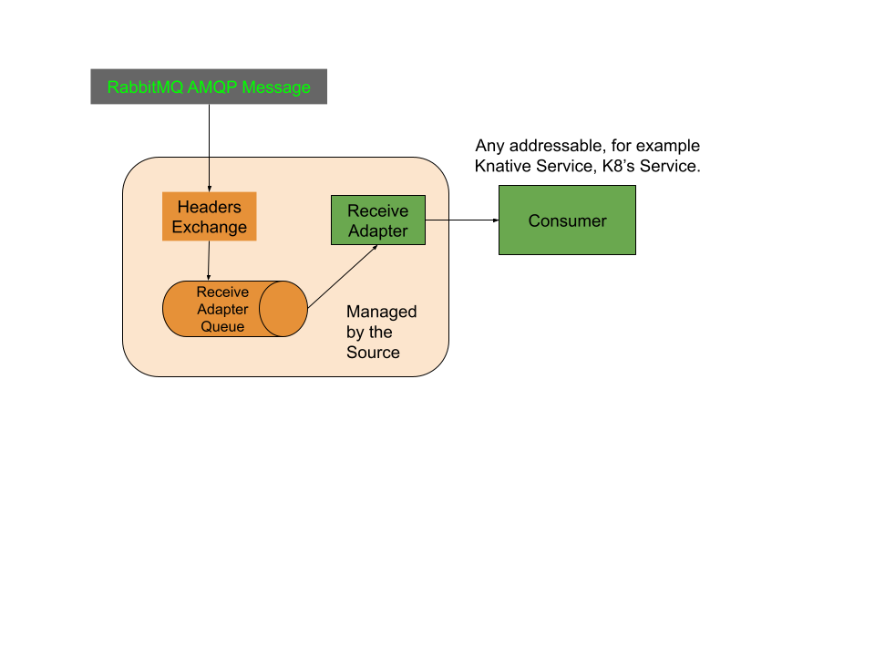

# RabbitMQ Source

The RabbitMQ source translates messages on a RabbitMQ exchange to CloudEvents
based on the [RabbitMQ Protocol Binding for CloudEvents Spec](https://github.com/knative-sandbox/eventing-rabbitmq/blob/main/cloudevents-protocol-spec/spec.md),
which can then be used with Knative Eventing over HTTP. The source can bind to
an existing RabbitMQ exchange, or create a new exchange if required.




# Table of Contents

- [Prerequisites](#prerequisites)
- [Installation](#installation)
- [Published Events](#published-events)
- [Samples](#samples)
- [Creating and Managing Sources](#creating-and-managing-sources)
- [Configuration Options](#configuration-options)
- [Next Steps](#next-steps)
- [Additional Resources](#additional-resources)
- [Upgrade](#upgrade)
- [Uninstall](#uninstall)

## Prerequisites

### Install using the RabbitMQ Message Topology Operator and RabbitMQ Cluster Operator (Recommended)

* Follow the [Broker's Prerequisites Section](../broker/README.md#prerequisites)

* Before we can create the Knative Eventing Source, we first need to create a RabbitMQ Cluster:

```shell
kubectl apply -f - << EOF
apiVersion: rabbitmq.com/v1beta1
kind: RabbitmqCluster
metadata:
  name: rabbitmq
  namespace: default
spec:
  replicas: 1
EOF
```

### Install without the RabbitMQ Cluster Operator

* You will need a RabbitMQ instance running and accessible via an URL/IP

* Install everything except the [RabbitMQ Cluster Operator](https://github.com/rabbitmq/cluster-operator)

* Note: An external RabbitMQ instance can be used, but if you want to use the `Source` without predeclared resources (specifically the `Exchange` and `Queue`), the `RabbitMQ Message Topology Operator` needs to be installed in the same Kubernetes Cluster as the `Source`.

## Installation

You can install the latest released version of the [Knative RabbitMQ Source](https://github.com/knative-sandbox/eventing-rabbitmq/releases/):

```shell
kubectl apply --filename https://github.com/knative-sandbox/eventing-rabbitmq/releases/latest/download/rabbitmq-source.yaml
```

If you wanted to install a specific version, e.g., v0.25.0, you can run:

```shell
kubectl apply --filename https://github.com/knative-sandbox/eventing-rabbitmq/releases/download/v0.25.0/rabbitmq-source.yaml
```

You can install a nightly version:

```shell
kubectl apply -f https://storage.googleapis.com/knative-nightly/eventing-rabbitmq/latest/rabbitmq-source.yaml
```

Or if you want to run the latest version from this repo, you can use [`ko`](https://github.com/google/ko) to install it.

- Install the `ko` CLI for building and deploying purposes.

   ```shell script
   go install github.com/google/ko@latest
   ```

- Configure container registry, such as a Docker Hub account, is required.

- Export the `KO_DOCKER_REPO` environment variable with a value denoting the
   container registry to use.

   ```shell script
   export KO_DOCKER_REPO="docker.io/YOUR_REPO"
   ```
- Install the source operator
   ```
   ko apply -f config/source/
   ```

Now you can create a RabbitMQ source in the default namespace running:
```sh
kubectl apply -f - << EOF
apiVersion: sources.knative.dev/v1alpha1
kind: RabbitmqSource
metadata:
  name: rabbitmq-source
spec:
  broker: "rabbitmq:5672/"
  user:
    secretKeyRef:
      name: rabbitmq-default-user
      key: username
  password:
    secretKeyRef:
      name: rabbitmq-default-user
      key: password
  connectionSecret:
    name: rabbitmq-default-user # used when exchange and queue are not predeclared
  channelConfig:
    globalQos: false
  exchangeConfig:
    name: "eventing-rabbitmq-source"
  queueConfig:
    name: "eventing-rabbitmq-source"
  sink:
    ref:
      apiVersion: serving.knative.dev/v1
      kind: Service
      name: rabbitmq-source-sink
      namespace: source-demo
EOF
```

## Published Events

All messages received by the source are published in binary mode with the following schema:

If it is already a CloudEvent, the message is forwarded in binary mode. If it isn't:

Event attributes
| Attribute | Value  | Notes  |
|-----------|--------|--------|
| `type` | `dev.knative.rabbitmq.event` | |
| `source` | `/apis/v1/namespace/*$NS*/rabbitmqsources/*$NAME*#*$QUEUE_NAME*` | `NS`, `NAME` and `QUEUE_NAME` are derived from the source configuration |
| `id` | A unique ID | This uses the `MessageId` if available, and a UUID otherwise |
| `subject` | The ID of the message | Empty string if no message ID is present |
| `content-type` | Extracted from the RabbitMQ `MessageContentType` | Any valid Content Type  |
| `time` | A timestamp | This uses the `MessageTimestamp` if Available |

The payload of the event is set to the data content of the message.

## Samples

For a message published with the payload "Hello rabbitmq!", for example with
[`rabbitmqadmin`](https://www.rabbitmq.com/management-cli.html):

```sh
rabbitmqadmin publish exchange=amq.default payload="Hello rabbitmq!"
```

The source sends the following event content:

.CloudEvents JSON format

```json
{
  "specversion": "1.0",
  "type": "dev.knative.rabbitmq.event",
  "source": "/apis/v1/namespaces/default/rabbitmqsources/rabbitmq-source",
  "id": "f00c1f52-33a1-4d3d-993f-750f20c804da",
  "time": "2020-12-18T01:15:20.450860898Z",
  "subject": "f00c1f52-33a1-4d3d-993f-750f20c804da",
  "datacontenttype": "application/json",
  "data": "Hello rabbitmq!"
}
```

## Creating and Managing Sources

Sources are Kubernetes objects. In addition to the standard Kubernetes
`apiVersion`, `kind`, and `metadata`, they have the following `spec` fields:

Source parameters
| Field  | Value  |
|--------|--------|
| `broker` | Host+Port of the Broker, with a trailing "/" |
| `vhost` * | VHost where the source resources are located |
| `predeclared` | Defines if the source should try to create new queue or use predeclared one (Boolean) |
| `backoffPolicy` | The backoff policy type (linear, exponential) String |
| `backoffDelay` | Is the delay to be used before retrying by the backoff policy (String) |
| `retry` | Number of retries to be used by the backoff policy  (Int) |
| `user.secretKeyRef` | Username for Broker authentication; field `key` in a Kubernetes Secret named `name` |
| `password.secretKeyRef` | Password for Broker authentication; field `key` in a Kubernetes Secret named `name` |
| `connectionSecret` | The name of the RabbitMQ secret |
| `exchangeConfig.name` | Name of the exchange |
| `queueConfig.name` | Name of the queue |
| `channelConfig.parallelism` * | Int that sets the [Consumer Prefetch Value](https://www.rabbitmq.com/consumer-prefetch.html) and creates `n` parallel consumer processes. Default value is `1`. Value must be between `1` and `1000`. With a value of `1` the RabbitMQ Source process events in FIFO order, values above `1` break message ordering guarantees and can be seen as more performance oriented. |html#sharing-the-limit) is handled. |
| `sink` | A reference to an [Addressable](https://knative.dev/docs/eventing/#event-consumers) Kubernetes object |
| `serviceAccountName` | The service account name to be used by the Receive Adapter deployments generated by the Source |

`*` These attributes are optional.

You will need a Kubernetes Secret to hold the RabbitMQ username and password. The RabbitMQ Cluster Operator creates a default one.

* To create and edit the Source's default user secret and add the the RabbitMQ http uri, see the [Source's samples Readme](../../samples/source/quick-setup/README.md#add-rabbitmq-http-uri-to-secret)

Note that many parameters do not need to be specified. Unspecified optional
parameters will be defaulted to `false` or `""` (empty string).

```yaml
apiVersion: sources.knative.dev/v1alpha1
kind: RabbitmqSource
metadata:
  name: rabbitmq-source
spec:
  broker: "rabbitmq:5672/"
  user:
    secretKeyRef:
      name: "rabbitmq-secret"
      key: "username"
  password:
    secretKeyRef:
      name: "rabbitmq-secret"
      key: "password"
  queueConfig:
    name: "a-queue"
  predeclared: true
  sink:
    ref:
      apiVersion: serving.knative.dev/v1
      kind: Service
      name: event-display
```

The Source will provide output information about readiness or errors via the
`status` field on the object once it has been created in the cluster.

<!---// TODO: should we have error documentation?--->

### Configuration Options

- Event source parameters.

  - Configure channel config properties based on this documentation.

    ```
    1. With a parallelism greater than zero, the server will deliver that many
    messages to consumers before acknowledgments are received.  The server ignores
    this option when consumers are started with noAck because no acknowledgments
    are expected or sent.

    2. To get round-robin behavior between consumers consuming from the same queue on
    different connections, set the parallelism to 1, and the next available
    message on the server will be delivered to the next available consumer.

    3. If your consumer work time is reasonably consistent and not much greater
    than two times your network round trip time, you will see significant
    throughput improvements starting with a prallelism of 2 or slightly
    greater as described by benchmarks on RabbitMQ.

    4. http://www.rabbitmq.com/blog/2012/04/25/rabbitmq-performance-measurements-part-2/
    ```

  - Configure exchange config properties based on this documentation.

    ```
    1. Exchange names starting with "amq." are reserved for pre-declared and
    standardized exchanges. The client MAY declare an exchange starting with
    "amq." if the passive option is set, or the exchange already exists. Names can
    consist of a non-empty sequence of letters, digits, hyphen, underscore,
    period, or colon.

    2. Note: RabbitMQ declares the default exchange types like 'amq.fanout' as
    durable, so queues that bind to these pre-declared exchanges must also be
    durable.

    3. Optional amqp.Table of arguments that are specific to the server's implementation of
    the exchange can be sent for exchange types that require extra parameters.
    ```

  - Configure queue config properties based on this documentation.

    ```
    1. The queue name may be empty, in which case the server will generate a unique name
    which will be returned in the Name field of Queue struct.
    ```

- [Observability Configuration](https://github.com/knative/eventing/blob/main/config/core/configmaps/observability.yaml)

- [Logging Configuration](https://github.com/knative/eventing/blob/main/config/core/configmaps/logging.yaml)
ConfigMaps may be used to manage the logging and metrics configuration.

## Next Steps

Check out the [Source Samples Directory](../../samples/source) in this repo and start converting your messages to CloudEvents with Eventing RabbitMQ!

## Additional Resources

- [RabbitMQ Docs](https://www.rabbitmq.com/documentation.html)
- [Knative Docs](https://knative.dev/docs/)

## Upgrade
- Prior to upgrading eventing-rabbitmq, Knative and its components should be updated according to instructions [here](https://knative.dev/docs/install/upgrade/). Be sure to pay attention to any
steps for upgrading Custom Resource Definitions (CRDs) and only upgrade one minor version at a time.
- Upgrade [RabbitMQ Cluster Operator](https://github.com/rabbitmq/cluster-operator) and [RabbitMQ Topology Operator](https://github.com/rabbitmq/messaging-topology-operator)

Upgrade eventing-rabbitmq one minor version at a time while following any migration steps outlined in release notes to migrate the RabbitMQ Source CRD.
Components and resources can be applied in a similar fashion to installation:

```shell
kubectl apply --filename https://github.com/knative-sandbox/eventing-rabbitmq/releases/download/knative-v1.4.0/rabbitmq-source.yaml
```

## Uninstall
### Remove eventing-rabbitmq components and resources
Use `kubectl delete --filename <installation-file>` to remove the components installed during [Installation](#installation). For example:

```shell
kubectl delete --filename https://github.com/knative-sandbox/eventing-rabbitmq/releases/download/v0.25.0/rabbitmq-source.yaml
```

If `ko` was used to install, can also be used for uninstallation:

```
ko delete -f config/source/
```

### Uninstall Knative Serving and Eventing
Follow the instructions [here](https://knative.dev/docs/install/uninstall/#uninstalling-optional-channel-messaging-layers) to uninstall Knative components.
