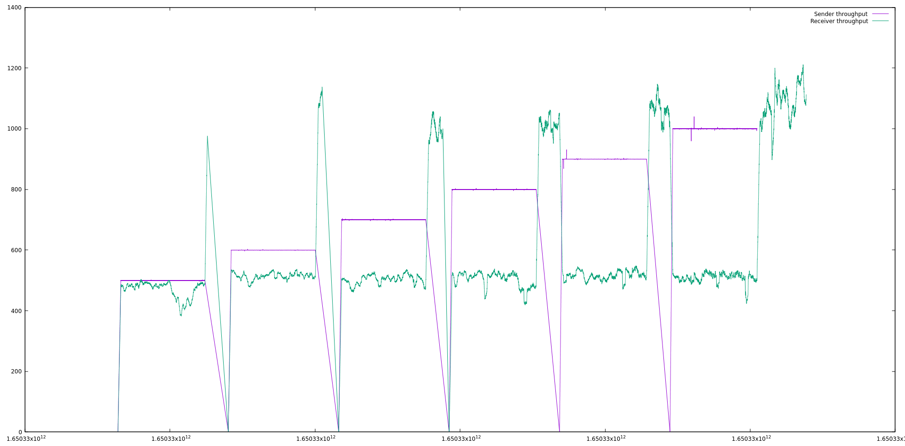

# Performance Tests

## 1/5. Pre-requisites

- GKE 1.21 with autoscaling
- kubectl 1.21
- [ko 0.9.3](https://github.com/google/ko/releases/tag/v0.9.3) + [`KO_DOCKER_REPO`](https://github.com/knative/eventing/blob/main/DEVELOPMENT.md#setup-your-environment)
- A git clone of [knative-sandbox/eventing-rabbitmq](https://github.com/knative-sandbox/eventing-rabbitmq) at tag `knative-v1.3.1`


## 2/5. Install Knative Serving

We install a specific version of Knative - [v1.3.1](https://github.com/knative/eventing/releases/tag/knative-v1.0.0) - as this is a point-in-time guide.
While we expect subsequent versions to continue working the same way, in the absence of automated tests that ensure this, we stick to exact versions that we have tested manually.

```sh
# Installing Knative Serving ... https://github.com/knative/serving/releases
kubectl apply --filename https://github.com/knative/serving/releases/download/knative-v1.3.1/serving-crds.yaml
kubectl apply --filename https://github.com/knative/serving/releases/download/knative-v1.3.1/serving-core.yaml

# Installing Knative Serving Kourier networking layer ... https://github.com/knative/net-kourier/releases
kubectl apply --filename https://github.com/knative/net-kourier/releases/download/knative-v1.3.1/kourier.yaml

# Patching Knative Serving to use Kourier for the networking layer ...
kubectl patch configmap/config-network \
  --namespace knative-serving \
  --type merge \
  --patch '{"data":{"ingress.class":"kourier.ingress.networking.knative.dev"}}'
```


## 3/5. Install Knative Eventing RabbitMQ

```sh
# Installing Knative Eventing ... https://github.com/knative/eventing/releases
kubectl apply --filename https://github.com/knative/eventing/releases/download/knative-v1.3.1/eventing-crds.yaml
kubectl apply --filename https://github.com/knative/eventing/releases/download/knative-v1.3.1/eventing-core.yaml
kubectl apply --filename https://github.com/knative/eventing/releases/download/knative-v1.3.1/in-memory-channel.yaml
kubectl apply --filename https://github.com/knative/eventing/releases/download/knative-v1.3.1/mt-channel-broker.yaml

# Installing RabbitMQ Operator ... https://github.com/rabbitmq/cluster-operator/releases
kubectl apply --filename https://github.com/rabbitmq/cluster-operator/releases/download/v1.12.1/cluster-operator.yml

# Installing cert-manager 1.5.x ... https://github.com/jetstack/cert-manager/releases
curl -sL https://github.com/jetstack/cert-manager/releases/download/v1.7.2/cert-manager.yaml \
| sed 's/kube-system/cert-manager/' \
| kubectl apply --namespace cert-manager --filename -

# Installing RabbitMQ Messaging Topology Operator with cert-manager integration ... https://github.com/rabbitmq/messaging-topology-operator/releases
kubectl apply --filename https://github.com/rabbitmq/messaging-topology-operator/releases/download/v1.5.0/messaging-topology-operator-with-certmanager.yaml


### Broker Benchmarks 

# Installing Knative Eventing RabbitMQ Broker ... https://github.com/knative-sandbox/eventing-rabbitmq/releases
kubectl apply --filename https://github.com/knative-sandbox/eventing-rabbitmq/releases/download/knative-v1.3.1/rabbitmq-broker.yaml
```

In case you want to test the latest dev version of eventing-rabbitmq, follow these steps:

```sh
git clone https://github.com/knative-sandbox/eventing-rabbitmq $GOPATH/src/knative.dev/eventing-rabbitmq
cd $GOPATH/src/knative-dev/eventing-rabbitmq
ko apply --filename config/broker
```

## 4/5. Run Knative Eventing RabbitMQ benchmarks

```sh
cd $GOPATH/src/knative.dev/eventing-rabbitmq
# If this directory is missing, run:
# git clone https://github.com/knative-sandbox/eventing-rabbitmq $GOPATH/src/knative.dev/eventing-rabbitmq
ko apply --filename test/performance/broker-setup/100-broker-perf-setup.yaml
kubectl wait --for=condition=AllReplicasReady=true rmq/rabbitmq-test-cluster --timeout=10m --namespace perf-eventing
kubectl wait --for=condition=IngressReady=true brokers/rabbitmq-test-broker --timeout=10m --namespace perf-eventing
kubectl wait --for=condition=SubscriberResolved=true triggers/rabbitmq-broker-perf --timeout=10m --namespace perf-eventing
```
The default setup has a Trigger's Parallelism value of:
`rabbitmq.eventing.knative.dev/parallelism: "100"`

Change this value to try different scenarios better reflecting your application needs

Now run any of the two test types.
To run the increasing load test:
```
ko apply --filename test/performance/broker-setup/200-broker-increasing-load-setup.yaml
```
To run the constant load test:
```
ko apply --filename test/performance/broker-setup/300-broker-constant-load-setup.yaml
```
``
To run the multi consumer load test:
```
ko apply --filename test/performance/broker-setup/400-broker-multi-consumer-setup.yaml
```
## 5/5. Download & visualize Knative Eventing RabbitMQ benchmark results

Pre-requisite: [gnuplot](http://www.gnuplot.info/) (on macOS it's `brew install gnuplot`)

```sh
cd $GOPATH/src/knative.dev/eventing-rabbitmq
kubectl wait --for=condition=complete job/rabbitmq-broker-perf-send-receive --timeout=10m --namespace perf-eventing
kubectl port-forward rabbitmq-broker-perf-aggregator 10001:10001 --namespace perf-eventing

# in a new split/tab/window
cd $GOPATH/src/knative.dev/eventing-rabbitmq/test/performance
curl http://localhost:10001/results > eventing-rabbitmq-broker-perf-results.csv
gnuplot -c latency-throughput.plg eventing-rabbitmq-broker-perf-results.csv 0.8 0 1100
# this can take up to 5 minutes to render ¯\_(ツ)_/¯
Try using higher values for the multi-consumer test setup
```

> What do the `0.8 0 1100` arguments mean?
>
> * `0.8` is the time in seconds, and it is the max allowed size for the y1 axis
> * `0` and `1100` are the message throughput, and it they represent the min and max boundaries of the y2 axis


To visualize just the end-to-end event latency, run:

```sh
gnuplot -c latency.plg eventing-rabbitmq-broker-perf-results.csv 0.8 0 1500
```


To visualize just the end-to-end event throughput, run:

```sh
gnuplot -c throughput.plg eventing-rabbitmq-broker-perf-results.csv 0.8 0 1100
# this can take up to 5 minutes to render ¯\_(ツ)_/¯
```



## Cleanup

To cleanup performance tests resources run:
```
kubectl delete --filename test/performance/broker-setup/200-broker-increasing-load-setup.yaml
```
and/or:
```
kubectl delete --filename test/performance/broker-setup/300-broker-constant-load-setup.yaml
```
finally:
```
kubectl delete --filename test/performance/broker-setup/100-broker-perf-setup.yaml
```
